### Olá, sou Alexandre Belisário! 👋

Economista de formação com mais de seis anos no IBGE, onde desenvolvo automações em SAS e Python para análise e validação de dados econômicos. Em transição para desenvolvimento backend Java — curso pós-graduação em Arquitetura e Desenvolvimento Java pela FIAP, onde venho construindo projetos com Spring Boot, microsserviços, mensageria e padrões como Clean Architecture, Hexagonal.

---

## 🛠️ Tecnologias

  
  
  
  
  
  
  
  
  

---

## 📊 GitHub Stats

---

## 🔭 Atualmente

- 🎓 Pós-graduação em **Arquitetura e Desenvolvimento Java** — FIAP (conclusão prevista: Jul/Ago 2026)
- ⚡ Desenvolvendo a **Fase 4 do Tech Challenge**: plataforma serverless em Azure com Quarkus e Azure Functions
- 🚀 Direcionando minha carreira para **desenvolvimento backend Java**
